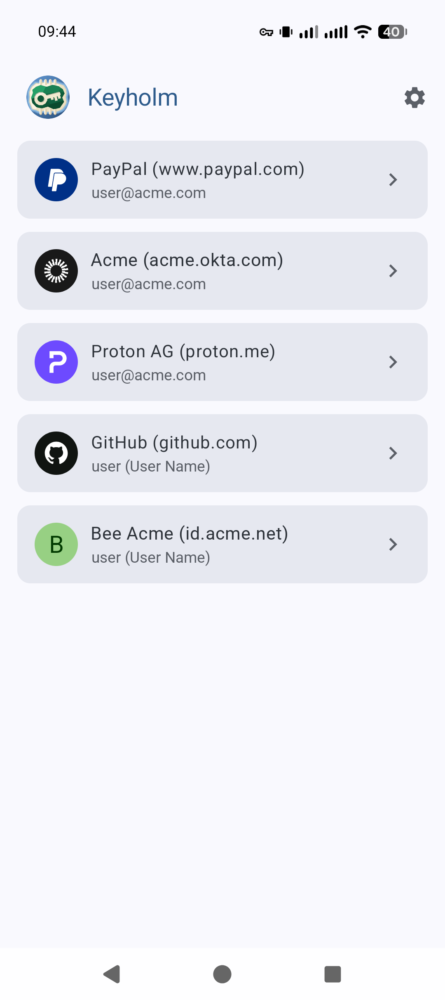
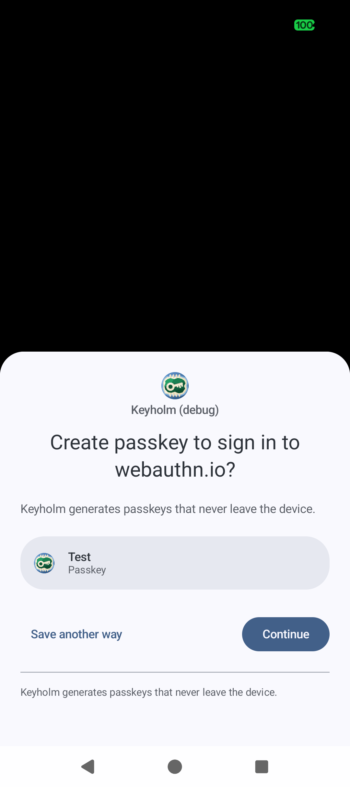
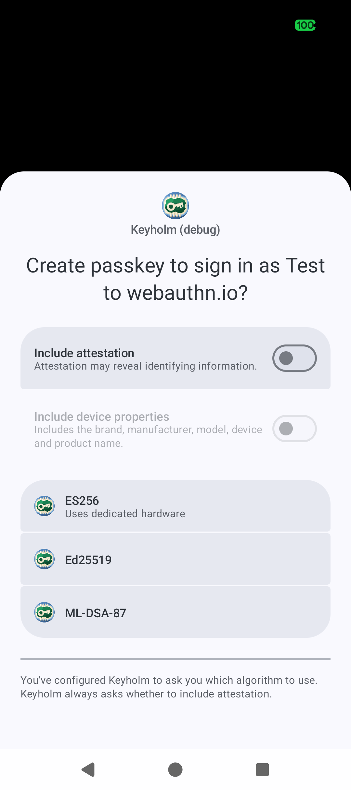
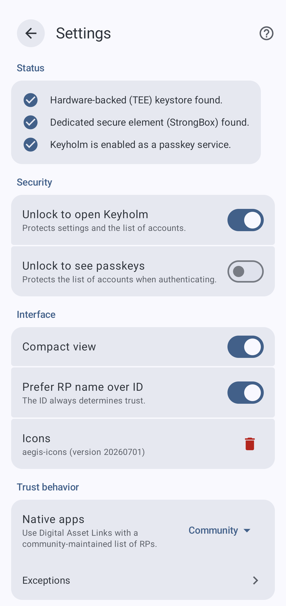
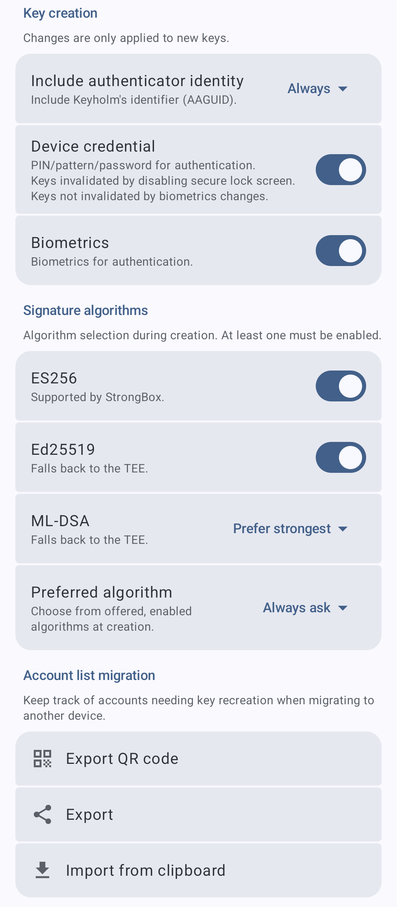

# 

<table>
  <tr>
    <td width="20%" align="center">
      <a href="docs/screenshots/main.png"></a>
    </td>
    <td width="20%" align="center">
      <a href="docs/screenshots/create-1.png"></a>
    </td>
    <td width="20%" align="center">
      <a href="docs/screenshots/create-2.png"></a>
    </td>
    <td width="20%" align="center">
      <a href="docs/screenshots/settings-1.png"></a>
    </td>
    <td width="20%" align="center">
      <a href="docs/screenshots/settings-2.png"></a>
    </td>
  </tr>
  <tr>
    <td align="center"></td>
    <td></td>
    <td></td>
    <td></td>
    <td></td>
  </tr>
</table>

## Features

Keyholm is all about single-device passkeys (i.e. client-side discoverable credentials)
whose private key is protected by secure hardware.

You can never export or sync these passkeys.

Think of Keyholm as a way to activate the built-in security key on your phone.

- target devices: Google Pixels (with Titan M2+)
- no network permission
- GrapheneOS
  - no Google Play Services ever
- requires latest Android version/APIs
- allows extensive control over particulars of what credentials it creates and how.
  - supports ES256: it's the only EC, StrongBox-backed algorithm
  - supports Ed25519: it's not NIST and it's fast and safer, TEE-only
  - supports ML-DSA: post-quantum!, TEE-only
- supports `android-key` attestation
- supports `prf` extension
- uses `QUERY_ALL_PACKAGES` in order to icons for apps that were denied trust
  - since we don't have network I don't see any danger to this
- _account list_ export/import
  - for making it marginally easier to switch devices
  - still all keys still need to be manually recreated on the new device

## Releases

[](https://apps.obtainium.imranr.dev/redirect?r=obtainium://app/%7B%22id%22%3A%22app.keyholm%22%2C%22url%22%3A%22https%3A%2F%2Fgithub.com%2Fkeyholm%2Fkeyholm%22%2C%22author%22%3A%22keyholm%22%2C%22name%22%3A%22Keyholm%22%2C%22additionalSettings%22%3A%22%7B%5C%22apkFilterRegEx%5C%22%3A%5C%22%5Ekeyholm%5C%5C%5C%5C.apk%24%5C%22%2C%5C%22includePrereleases%5C%22%3Atrue%7D%22%7D)

Releases are done via GitHub workflows, see the releases themselves for how to
verify provenance of the artifacts.

### Verification

Verify APK signatures with
[apksigner](https://developer.android.com/tools/apksigner#options-verify):

```
apksigner verify --print-certs -v keyholm.apk
```

The output should include:

```
Verifies
Verified using v1 scheme (JAR signing): false
Verified using v2 scheme (APK Signature Scheme v2): false
Verified using v3 scheme (APK Signature Scheme v3): true
Number of signers: 1
```

and the signer should be this certificate:

```
Signer #1 certificate DN: CN=Keyholm
Signer #1 certificate SHA-256 digest: 9185c957794a7ff443f5bd453b1c913d80bad0d09d14882e1df281c681f0a92e
```

## Building

This project doesn't use `gradlew`. Install `mise`.

## Stability

No guarantees whatsoever before v0.1.0. Releases may completely invalidate any saved keys
and require a full reset or even an uninstall.

## Security

### Settings

Settings are protected by default by device credentials/biometrics so they
cannot be modified through the app without authorization.

### Metadata

Optionally, even _showing_ the accounts for a given site can be protected
by credentials/biometrics.

Keyholm's state is solely metadata about the keys it manages. That includes a
list of users at RPs that the Keyholm user has access to.

### Key material

Passkey private keys are themselves encrypted with a key that lives on secure hardware.
Signing with the passkey private key is protected by device credentials/biometrics at the
hardware level. Even `root` cannot get at the private key material.

### Threats

#### Filesystem dump

No matter how Keyholm manages its state, the worst a filesystem dump could reveal
is the list of users at which sites you have access to.

#### Unlocked device UI access

You can require unlock to open Keyholm or even see the list of passkeys for a
site,
so given simple physical access to the device, protection is always at least
device credential/biometrics.

#### Root

`root` can do whatever it wants with Keyholm, its memory and its files.
That means it can trick you, it could prompt you to authenticate
and sign whatever it wants with your passkeys.

Besides extracting all metadata, this means the worst case is probably
getting you to authorize key usage and using that authorization to forward
access to your account.

Additionally, every _public key_ is enumerable and those public keys
are the ones known by the RPs. So if an attacker knows what
_public keys_ they're looking for and your device is `root` compromised,
there's no mechanism to protect that list of _public keys_. They don't need
Keyholm's metadata to connect you with that user/site.

However, `root` cannot get to the passkey private key material or extract it.

## Roadmap

### UX

- ordering/grouping options of some kind
- since no play services means no signal API, support at least for editing the
  name/display name
- translations if anybody wants them

### Hybrid transport

- CTAP 2.3 BLE hybrid transport support (i.e. scan a QR code with Keyholm)
  - Only requires Nearby devices aka Bluetooth permissions.

### Security

- Password protection **for Keyholm**: this would protect Keyholm from being used,
  given physical access, in spite of knowledge of device credential/biometrics access.
  Note that it's **not possible** to fully protect the private keys
  themselves with a password while also keeping them device-bound.
  `root` access will ALWAYS remove any password protection to the keys
  themselves.
- Device-bound key encrypted **metadata**: would resist a simple filesystem dump

## License

Copyright (C) 2026 Michael Beaumont

This program is free software: you can redistribute it and/or modify
it under the terms of the GNU General Public License as published by
the Free Software Foundation, version 3.

This program is distributed in the hope that it will be useful,
but WITHOUT ANY WARRANTY; without even the implied warranty of
MERCHANTABILITY or FITNESS FOR A PARTICULAR PURPOSE. See the
GNU General Public License for more details.

You should have received a copy of the GNU General Public License
along with this program. If not, see <https://www.gnu.org/licenses/>.
